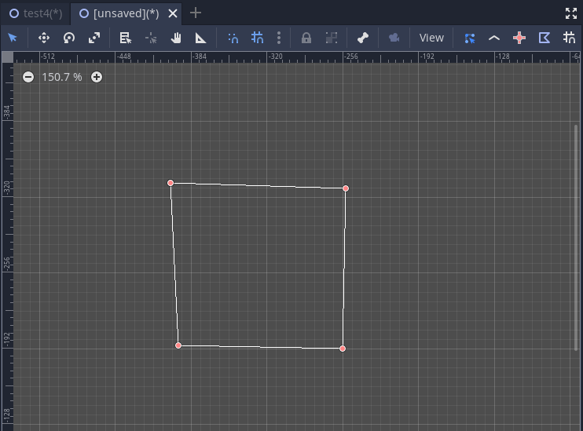
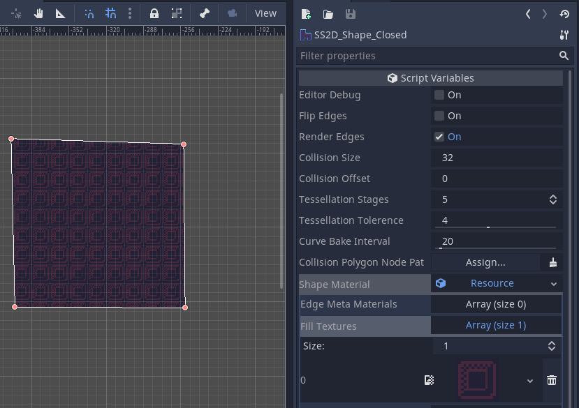
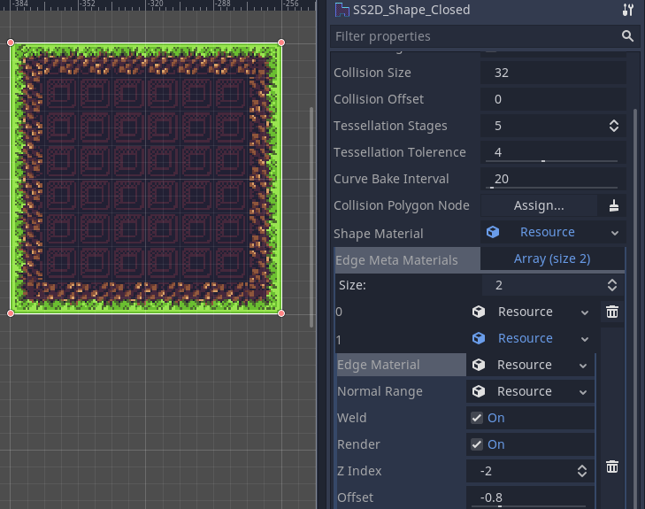

SmartShape2D
---

# About
This plugin allows you to create nicely textured 2D polys.
Simply place a few points then create / assign the shape material and you should have a good looking polygon.

The textures used are similar to what you would use if producing your levels with tilesets.

## Support
- Supported and Tesetd on Godot 3.2
- Should work with later versions of Godot 3.x

# Using The Plugin (Quickstart)
## Creating a Shape
- First, instance a node of either:
  - SS2D_Shape_Open
  - SS2D_Shape_Closed
- SS2D_Shape_Base cannot be instanced directly
- SS2D_Shape_Anchor is a node that attaches to a shape
- The following Nodes are legacy nodes and are deprecated:
  - RMSmartShape2D
  - RMSmartShape2DAnchor

## Editing the Shape
- After creating the shape node, make sure it's selected and the toolbar appears and is in Point Edit mode

- Click on the screen to begin adding points
  - If this is a closed shape, the polygon will close after adding the 3rd point
- You should now have a shape consisting of a few points and lines

## Setting the Fill Texture of the Shape (Closed Shape only)
- To give it some life, we'll want to edit the "Shape Material" in the Inspector
- Under "Shape Material" Expand "Fill Textures" and you'll see an empty array
- Set the Array's size to '1'
- Assign a texture to the newly created slot in the array
- After assigning the shape should now have a valid texture
  - If nothing happens after setting the texture, try to force the shape to update by adjusting one of the points
- **Note that "Fill Textures" does not affect SS2D_Shape_Open Nodes at all**
- If you want to add a normal_texture, you would add it using the "Fill Texture Normals" property

## Texturing the Edges
- This where the rubber hits the road, the real meat of the tool
- Under "Shape Material" add an element to the "Edge Meta Materials" property
  - Shape Material -> Edge Meta Materials
- Set the resource of the newly created element to "SS2D_Material_Edge_Metadata"
  - Unfortunately, due to Godot limitations, every avaiable resource will offered to you instead of the one you want
  - The options are alphabetized though, which helps in finding the resource you want
- Expand the first element of the "Edge Meta Materials" that you just set
  - Shape Material -> Edge Meta Materials -> element 1
- Set the value of the "Edge Material" property to a new resource of type "SS2D_Material_Edge"
  - Shape Material -> Edge Meta Materials -> element 1 -> Edge Material
- Expand "Edge Material" that you just set
- Add an element to "Textures" and assign the texture to one that you want to use as an edge
- The shape's edges should now update using the texture you set
  - If nothing happens after setting the texture, try to force the shape to update by adjusting one of the points
- If you want to add a normal_texture, you would add it using the "Texture Normals" property
- Godot should now look something like this:

### Corners
- If your shape has sharp 90-degree corners, the texture can look a bit warped in those places
- You can specify a unique texture to use for inner and outer corners for each Edge Material
- The following Edge Material properties are used for corners
  - Textures Corner Inner
  - Texture Normals Corner Inner
  - Textures Corner Outer
  - Texture Normals Corner Outer
- See how the addition of outer corner textures improves the square created earlier

### Multiple Edge Materials in One Edge
- You can add as many Edge Meta Materials as you want to a Shape Material, each with their own Edge Material
- For instance, you can add an additional egde with a rock texture (and its own set of corner textures) and have it render behind the grass
  - To have it render behind the grass, Set the Z index of the meta material

### Normal Range
- Each Meta material has a Normal Range
- The normal Range indicates when a texture should be rendered
- If the normal range is 0 - 360 or 0 - 0, then any angle is considered in range and the edge will always render
- Angle "0" is Facing directly Right
- Angle "90" is Facing directly Up
- Angle "180" is Facing directly Left
- Angle "270" is Facing directly Down

- If you wanted to, for example:
  - Have rocks display on the bottom part of the shape only
  - Have grass display on the sides and top of the shape only
- You could:
  - Set the grass Normal Range to 0 - 180
  - Set the rock Normal Range to 181 - 359

## Toolbar
### Point Edit
### Edge Edit
### Origin Set
### Generate Collision
### Snapping
# Shapes
Each shape consists of a set of points.
There are two kinds of shapes:
- Closed Shapes
  - The last point is connected to the first, forming a closed polygon
- Open Shapes
  - The last point is NOT connected to the first

There are two basic parts of any shape;
- The Edges
- The fill texture (Closed shape only)

Shapes can be configured to have multiple edges, each auto-generating at certain angles.
## Properties
### Editor Debug
- Will show the bounding box for each quad in the mesh of edges.
- Can be helpful to illustrate why a shape doesn't look the way you expect
### Flip Edges
- Will flip the edges of the shape (invert y)
### Render Edges
- Whether or not the edges of the shape should be rendered
### Collision Size
- Size of the collision shape
### Collision Offset
- Offset of where the collision shape starts and ends
### Tessellation Stages
- Number of stages in the curve tessellation process (Uses Curve2D Internally)
- First Param in Curve2D.tessellate
  - See [Curve2D Documentation](https://docs.godotengine.org/en/3.2/classes/class_curve2d.html#class-curve2d-method-tessellate)
### Tessellation Tolerence
- Tolerence Degrees in the curve tessellation process (Uses Curve2D Internally)
- Second Param in Curve2D.tessellate
  - See [Curve2D Documentation](https://docs.godotengine.org/en/3.2/classes/class_curve2d.html#class-curve2d-method-tessellate)
### Curve Bake Interval
- Bake interval value for Curve2D
- See [Curve2D Documentation](https://docs.godotengine.org/en/3.2/classes/class_curve2d.html#class-curve2d-property-bake-interval)
### Collision Polygon Node Path
- The path to the CollisionShape that the SmartShape will use for collision
- Is Autoset when pressing the generate collision button
### Shape Material
- The material that this shape will use to render itself
### Points
- All of the points and meta-data for the points contained in this shape
- This data structure is updated as you manipulate the shape
- There is no need to edit this by hand, but you can if you'd like
### Material Overrides
- When an edge is given a "Material Override" the data for that edge is stored here
-  :TODO - Add image of EdgeData window

- This data structure is updated as you manipulate the shape
- There is no need to edit this by hand, but you can if you'd like

# Shape Materials
Shape materials provide all the texture and collision information needed by the SmartShape nodes.
Once a shape material is defined, it can be easily reused by any number of SmartShape2D nodes.

A shape material consists of **Edge Meta Materials**
## Edge Meta Materials
An Edge Meta Material consists of pairs of **Edge Materials** and **Normal Ranges**
### Edge Materials
#### Taper Textures
#### Corner Textures
### Normal Range

# Anchoring Nodes to Sections of the Shape Node
You might have a desire to anchor nodes to various sections of the SmartShape2D node.  This is helpful in the level design by helping to automatically move other nodes in relation to the edited shape node.  Or, in the future, it might be useful adjust a shape dynamically and have the surrounding objects be affected by adjustments in the shape's contour.

This is done by use of the SmartShapeAnchor2D node.

# Keyboard Controls
- Cycle through texture indices of a vertex
  - Mouseover a vertex and MOUSEWHEEL up or down to increment / decrement the texture index

- Flip texture
  - Mouseover a vertex and press SPACE

- Move Edge
  - While in MOVE mode, mouseover an edge, hold SHIFT, then click and drag to move the two points that makeup the edge

- Add Bezier curve
  - Mouseover a vertex, hold SHIFT, then click and drag to create control points on the vertex

- Change texture width property
  - Mouseover a vertex, hold SHIFT, then MOUSEWHEEL up or down to increment / decrement the texture width

# Contibuting
If you have any suggestions, feel free to add an issue.
Please include the following three bits of information in each issue posted:
- Bug / Enhancement / Suggestion
- Godot Version
- SmartShape2D Version

We have a set of tests we run against the code (courtesy of [GUT](https://github.com/bitwes/Gut)).
If making a merge request, please ensure that the tests pass (or have been updated appropriately to pass)

# Version History
## 2.0
### Changes from 1.0
### New Features
