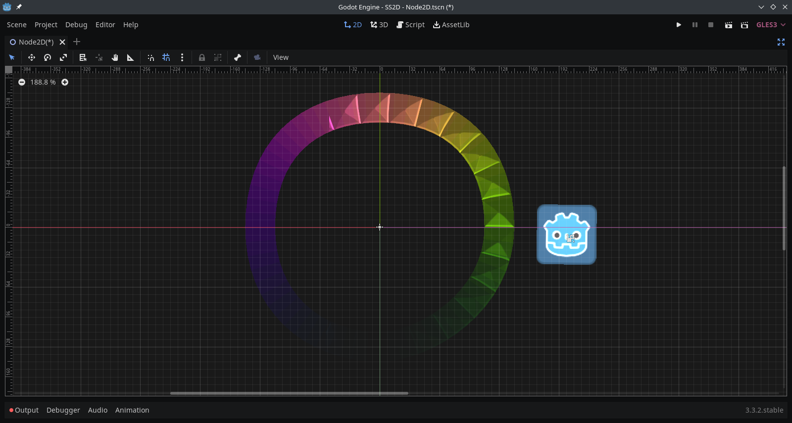
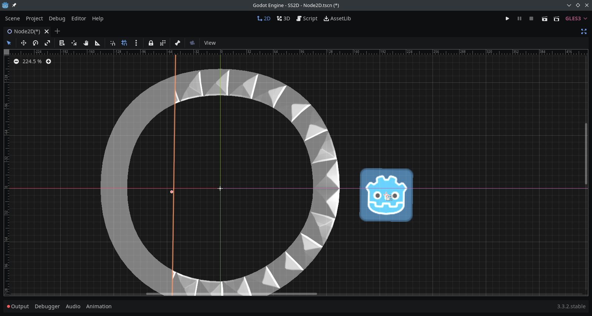

Normals
---

# Default Normals
Even if you assign normal textures to your Edge Material, the normals will look wrong.

For example, consider the following image:


The normals in the image clearly don't line up with where the light is actually coming from.

# Encoding Normal data in the canvas_item Vertex Shader Color Parameter
As SmartShape renders the edges, the textures and their normal textures are also rotated.
This will result in incorrect normals.
To solve this, we can use a shader to correctly calculate the normals.

The tricky part lies in how few ways there are to pass data to a canvasItem shader on a per-vertex basis.
See here for the full list:
https://docs.godotengine.org/en/stable/tutorials/shading/shading_reference/canvas_item_shader.html#doc-canvas-item-shader

Fortunately, the COLOR parameter can be used for this purpose.
The COLOR ENCODING paramter of an Edge Material can be used to choose what data is encoded in the
Vertex Shader's Color Parameter.

If we set the COLOR ENCODING value to "Normals", we get this:



Ok, so now the normals still look wrong, but the colors look wrong too. Great.

There is one final step before our normals will be correct. We need to decode the normal data in a shader.


# Writing a Shader

You'll want to assign a new shader to the Edge Material's material property.
This shader will determine how each edge is rendered.

Here's a sample shader to decode our normal data and set our actual color to that of our diffuse texture:
```
shader_type canvas_item;

varying mat2 NORMAL_MATRIX;

void vertex() {
	NORMAL_MATRIX = mat2(COLOR.rg, COLOR.ba)*2.0 - mat2(vec2(1.0), vec2(1.0));
	COLOR = texture(TEXTURE, UV);
}

void fragment() {
	NORMAL.xy = NORMAL_MATRIX*NORMAL.xy;
}
```

After assigning this shader the the Edge Material's material property, our normals finally look right:


