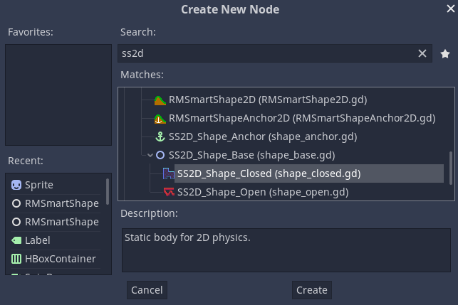
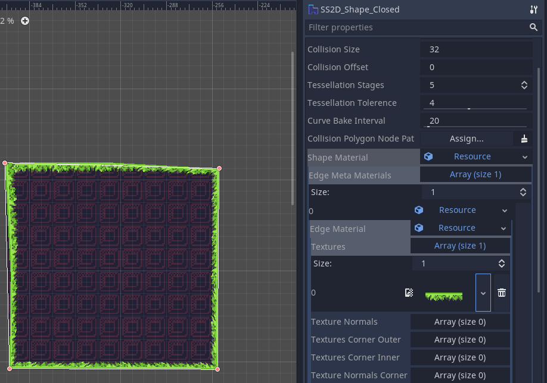
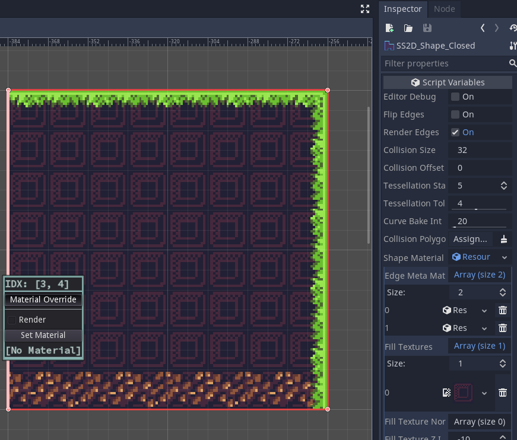

SmartShape2D - QuickStart
---

# Creating a Shape
- First, instance a node of either:
  - SS2D_Shape_Open
  - **SS2D_Shape_Closed**
	- **We'll use a closed shape for this Quickstart demo**
- SS2D_Shape_Base cannot be instanced directly
- SS2D_Shape_Anchor is a node that attaches to a shape
- The following Nodes are legacy nodes and are deprecated:
  - RMSmartShape2D
  - RMSmartShape2DAnchor

# Editing the Shape
- After creating the shape node, make sure it's selected and the toolbar appears and is in Point Edit mode
  - 
- Click on the screen to begin adding points
  - If this is a closed shape, the polygon will close after adding the 3rd point
- You should now have a shape consisting of a few points and lines:

# Setting the Fill Texture of the Shape (Closed Shape only)
- To give it some life, we'll want to edit the "Shape Material" in the Inspector
- Under "Shape Material" Expand "Fill Textures" and you'll see an empty array
- Set the Array's size to '1'
- Assign a texture to the newly created slot in the array
- After assigning the shape should now have a valid texture
  - If nothing happens after setting the texture, try to force the shape to update by adjusting one of the points
- **Note that "Fill Textures" does not affect SS2D_Shape_Open Nodes at all**
- If you want to add a normal_texture, you would add it using the "Fill Texture Normals" property

# Texturing the Edges
- This where the rubber hits the road, the real meat of the tool
- Under "Shape Material" add an element to the "Edge Meta Materials" property
  - Shape Material -> Edge Meta Materials
- Set the resource of the newly created element to "SS2D_Material_Edge_Metadata"
  - Unfortunately, due to Godot limitations, every avaiable resource will offered to you instead of the one you want
  - The options are alphabetized though, which helps in finding the resource you want
- Expand the first element of the "Edge Meta Materials" that you just set
  - Shape Material -> Edge Meta Materials -> element 1
- Set the value of the "Edge Material" property to a new resource of type "SS2D_Material_Edge"
  - Shape Material -> Edge Meta Materials -> element 1 -> Edge Material
- Expand "Edge Material" that you just set
- Add an element to "Textures" and assign the texture to one that you want to use as an edge
- The shape's edges should now update using the texture you set
  - If nothing happens after setting the texture, try to force the shape to update by adjusting one of the points
- If you want to add a normal_texture, you would add it using the "Texture Normals" property
- Godot should now look something like this:

## Corners
- If your shape has sharp 90-degree corners, the texture can look a bit warped in those places
- You can specify a unique texture to use for inner and outer corners for each Edge Material
- The following Edge Material properties are used for corners
  - Textures Corner Inner
  - Texture Normals Corner Inner
  - Textures Corner Outer
  - Texture Normals Corner Outer
- See how the addition of outer corner textures improves the square created earlier

## Multiple Edge Materials in One Edge
- You can add as many Edge Meta Materials as you want to a Shape Material, each with their own Edge Material
- For instance, you can add an additional egde with a rock texture (and its own set of corner textures) and have it render behind the grass
  - To have it render behind the grass, Set the Z index of the meta material

## Normal Range
- Each Meta material has a Normal Range
- The Normal Range indicates when a texture should be rendered
  - If the normal range is 0 - 360 or 0 - 0, then any angle is considered in range and the edge will always render
  - Angle "0" is Facing directly Right
  - Angle "90" is Facing directly Up
  - Angle "180" is Facing directly Left
  - Angle "270" is Facing directly Down

- If you wanted to, for example:
  - Have rocks display on the bottom part of the shape only
  - Have grass display on the sides and top of the shape only
- You could:
  - Set the grass Normal Range to 0 - 180
  - Set the rock Normal Range to 181 - 359

## Material Overrides
- Using Material Overrides will allow you to change how specific edges are rendered
- For Example, to prevent the left edge from rendering, we'll do the following:
  - Select the edge edit button from the toolbar 
  - Right Click the left edge of the shape
  - Press the "Material Override" Button
  - Uncheck the "Render" Checkbox

- You can use material overrrides to also specify a specific material for a single edge
- For example, Checking Render and choosing the "Rock" Edge Material will cause the edge to render as rocks, even though the NormalRange configuration would otherwise have it render as grass
